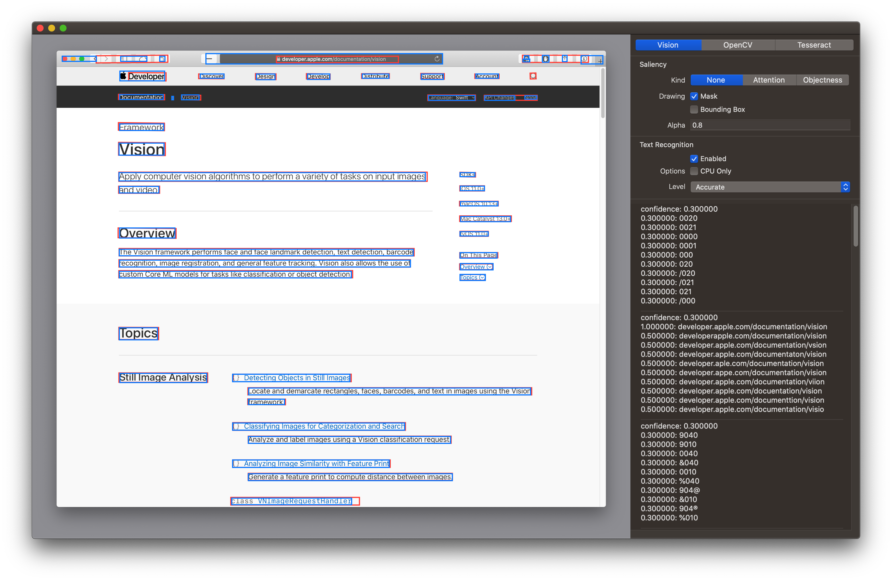
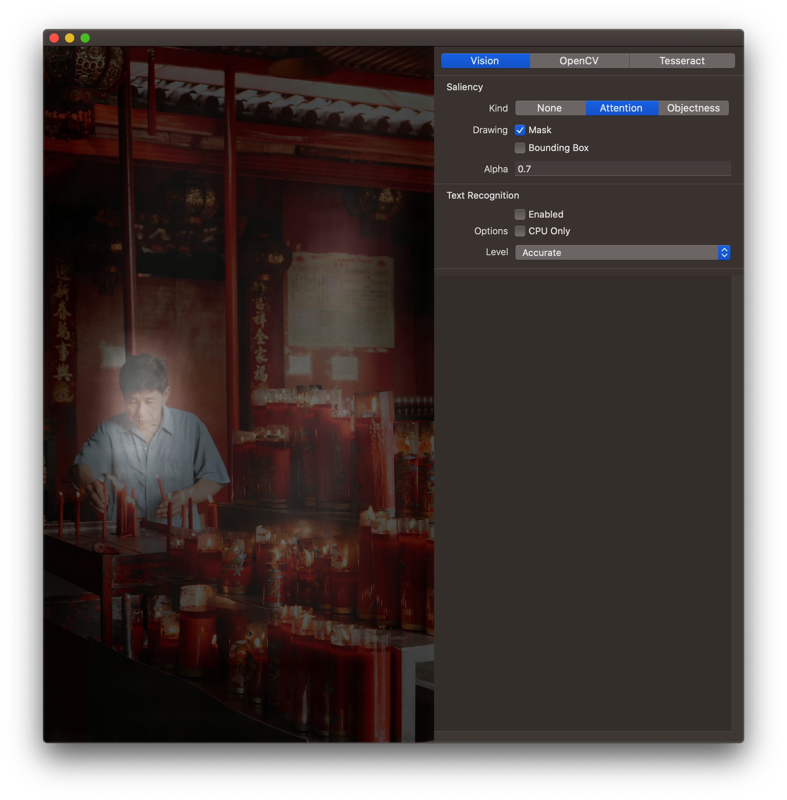

# ImageReader

macOS App for demonstrate image analysis tool like Vision.framework.

## Feature

### Vision.framework
- [x] Text Recognization
- [ ] Object Detecting
- [ ] Face Detecting
- [ ] Feature Print
- [x] Saliency
  - [x] Attention Based
  - [x] Objectness Based

### CoreImage.framework
- [ ] Object Detecting
- [ ] Face Detecting

### OpenCV
- [x] SURF Feature Detection
- [ ] Image Matching

### Tesseract
- [x] Text Recognization

## Setup
ImageReader using multiple framework to operate image. Please read the reference dependencies README to setup building environment.

- [SwiftTesseract](https://github.com/MainasuK/SwiftTesseract#setup): Setup Tesseract installation.

## Usage

This app is still under developing. Please build from source code via Xcode.app.

## Demo

> Photo from Unsplash @zis_view
